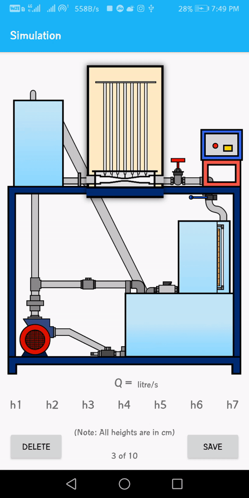
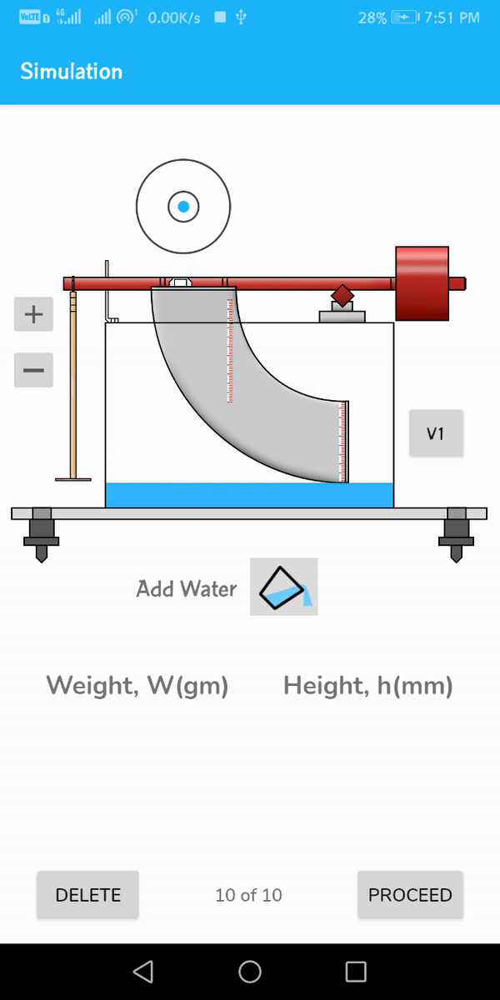
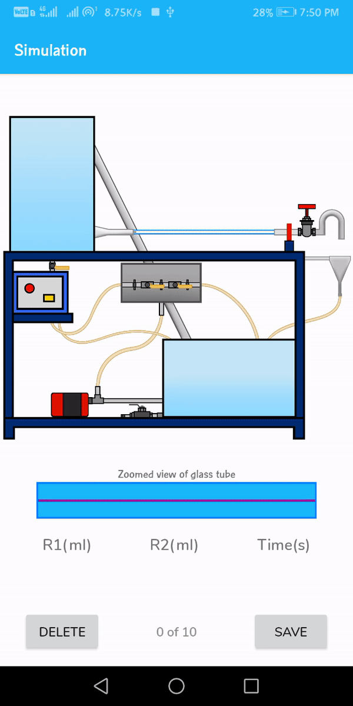
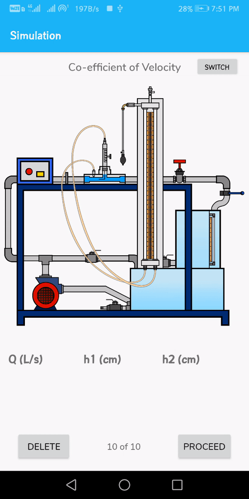

# Virtual-Fluids-Lab

Seeing the COVID'19 pandemic situation, we, a group of 5 IIT Patna students thought of developing an app to help our juniors perform the experiments virtually with the help of this app. As of now, they don't require internet connection for this app.

# How it looks

  

# Working of App

Each experiment has its own interactive simulation to provide user how the actual apparatus works and what are the things one has to handel while performing that experiment in actual time. The animation of the simulation of 4 completed experiments are shown below.

   
